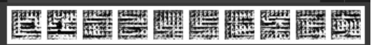

# Multi-Conditional cGAN: Sequential & Colored Image Synthesis

[](https://huggingface.co/spaces/brandynewanek/Color-Digit-Generator)

**A Conditional Generative Adversarial Network (cGAN) capable of synthesizing specific 3-digit sequences with user-defined colors.**

## 🎨 Project Overview
Standard GANs generate random noise. This **Multi-Conditional GAN** allows for precise control over the output. It takes a user's intent (e.g., *"Make a Red 5, Blue 2, and Green 9"*) and synthesizes a unique image from scratch using deep learning.

The project demonstrates the evolution from a simple grayscale generator to a complex multi-input model capable of handling **7 simultaneous conditions** (3 digits + 3 colors + noise).

**👉 [Try the Live Demo Here](https://huggingface.co/spaces/brandynewanek/Color-Digit-Generator)**

## 🏗️ Architecture Evolution (The 5 Stages)
The project followed an **Adversarial Co-Evolution** strategy, moving through five distinct engineering phases:

1.  **Grayscale Synthesis:** Established the baseline DCGAN architecture for MNIST (28x28).
2.  **Color Conditioning:** Modified the Generator to accept One-Hot encoded color labels and output 3-channel RGB images.
3.  **Sequence Generation:** Scaled the architecture to produce 28x84 pixel images (3 digits stitched horizontally).
4.  **Multi-Conditional Fusion:** The final model, accepting 7 simultaneous inputs (3 digits + 3 colors + Noise) via Concatenation Layers.
5.  **Deployment:** Containerized the inference logic for hosting via Gradio and Hugging Face Spaces.

## 🔧 The "War Story": Solving Mode Collapse
**The Challenge:**
In Phase 1, I attempted to use a **Pre-Trained Expert Classifier** as the Discriminator (Critic). The hypothesis was that a "perfect" teacher would speed up training.

**The Failure (The "Death Grid"):**
Instead of learning, the Generator suffered immediate **Mode Collapse**. The expert critic provided gradients that were too steep (vanishing gradients), forcing the Generator to output a static "Checkered Grid" pattern to exploit a local minimum in the critic's filter stride.


*(The "Death Grid" that resulted from using a pre-trained critic)*

**The Solution:**
I shifted to **Joint Adversarial Training** (Tabula Rasa). By initializing both networks from scratch, they evolved together ("Co-Evolution"), maintaining a balanced Nash Equilibrium where the Discriminator was never too powerful for the Generator to learn from.

## 🛠️ Tech Stack
* **Deep Learning:** TensorFlow / Keras (Custom Training Loops, GradientTape).
* **Architecture:** DCGAN (Deep Convolutional GAN) with Concatenation Layers for Conditioning.
* **Deployment:** Hugging Face Spaces, Gradio.
* **Techniques:** Latent Space Interpolation, One-Hot Encoding, Label Smoothing.

## 📂 Repository Structure
* `app/`: Source code for the Gradio dashboard (`app.py`) and deployment requirements.
* `notebooks/`: Jupyter Notebooks detailing the 5-stage development process (Grayscale -> Final).
* `reports/`: Full academic project report (PDF).
* `assets/`: Project images and failure cases.

## 🚀 How to Run Locally
1.  **Clone the repo:**
    ```bash
    git clone [https://github.com/brandynewanek/Multi-Conditional-GAN-Generator.git](https://github.com/brandynewanek/Multi-Conditional-GAN-Generator.git)
    ```
2.  **Install dependencies:**
    ```bash
    pip install -r app/requirements.txt
    ```
3.  **Run the dashboard:**
    ```bash
    python app/app.py
    ```
    *The app will launch at `http://127.0.0.1:7860`*
    
## 🖼️ Project Demo
Here is what the interface looks like:


## 👤 Author
**Brandyn Ewanek**
* [LinkedIn](https://www.linkedin.com/in/brandyn-ewanek-9733873b/)
* [Portfolio](https://github.com/Brandyn-Ewanek/)
